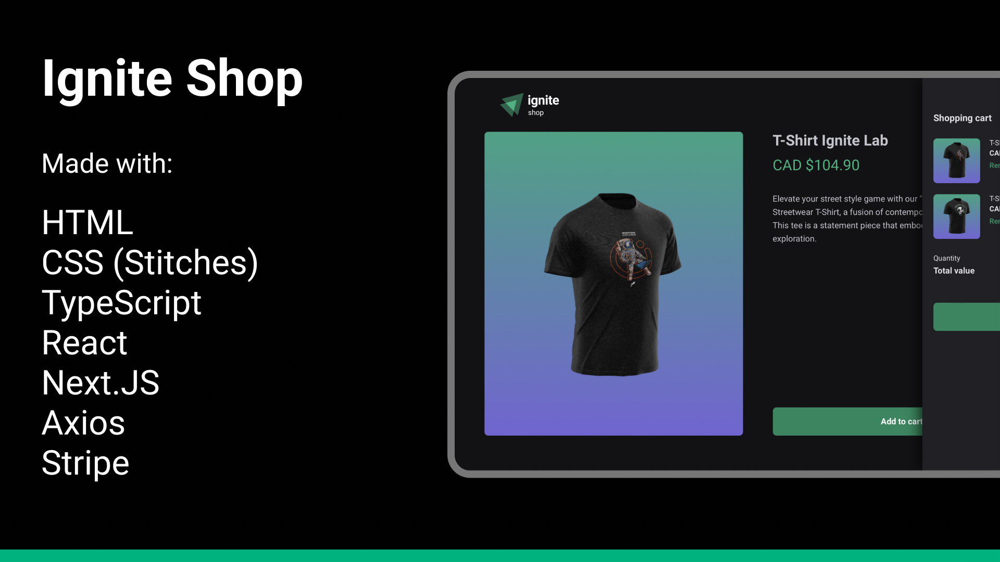

<h1 align="center"> Ignite Shop </h1>

<p align="center">
A web catalog of t-shirts that resembles an e-commerce flow, integrated with Stripe.
</p>

<p align="center">
Check it out live <a href="https://clothing-shop-stripe-nextjs.vercel.app">here</a>!
</p>

<p align="center">
  <a href="#technologies">Technologies</a>&nbsp;&nbsp;&nbsp;|&nbsp;&nbsp;&nbsp;
  <a href="#project">Project</a>&nbsp;&nbsp;&nbsp;|&nbsp;&nbsp;&nbsp;
  <a href="#learnings">Learnings</a>&nbsp;&nbsp;&nbsp;
</p>

<p align="center">
  
</p>

## Technologies

- HTML
- CSS (Stitches)
- TypeScript
- React
- Next.JS
- Axios
- Stripe

## Project

For this project, the goal was to explore Stitches for CSS and Stripe's API to handle payments. The layout itself is quite unique yet simple and currently it is displaying t-shirts but it can be adapted to anything.

All of the content (product images, titles, descriptions and prices) are coming directly from Stripe. Also, this project uses a mixture of SSG and SSR techniques in order to increase the page loading performance.

Since this was done purely for learning purposes, there are a few areas that were left on the side since they were not necessarily the focus area of the project (more on that on the next section). It was a fun project nonetheless though! Hopefully it can serve as a future reference for myself in the future.

This project requires some env variables to work! Please add them to a `.env.local` file before running. Also, again, since all the content comes from Stripe, your account needs items already set.

```
# App
NEXT_DEV_URL=http://localhost:3000

# Stripe
STRIPE_PUBLIC_KEY=
STRIPE_SECRET_KEY=
```

## Learnings

Stripe's API and Stitches were the two biggest learnings since I haven't used them before this concept project. About Next.JS itself, I gave a little more care about the SSG vs SSR strategies to practice the mental model behind these decisions (even though this has already changed in Next.JS' app folder).

There are still quite a bit that can be done to make the project better (not an extensive list):

- Design & develop the mobile styles (there is none)
- Add the ability to have different quantities per item OR allow the user to only ever add one of each item
- Add error handling tools like Sentry or Datadog
- Create an actual production Stripe account with items for the live version to work
